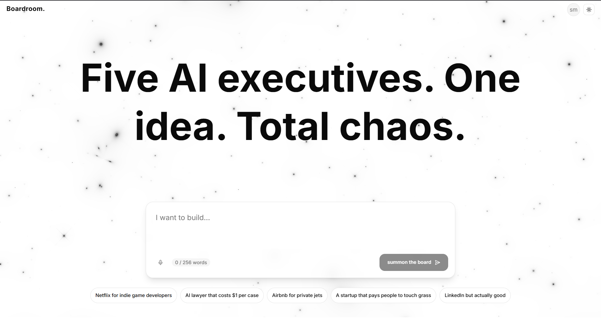
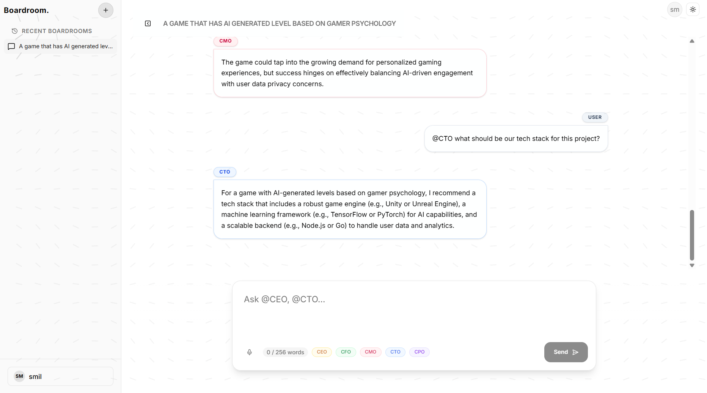
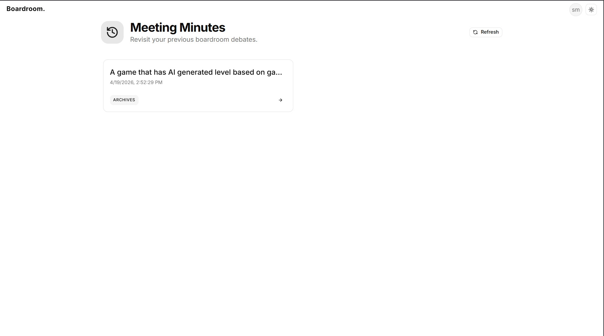

# Boardroom: The AI War Room for Your Startup

Boardroom is an AI-powered simulation platform designed to stress-test your startup ideas. Instead of pitching to a void, users pitch to a virtual C-suite of five specialized AI executives—CEO, CFO, CMO, CTO, and CPO—who debate, critique, and refine the concept in real-time.



## Purpose

The goal of Boardroom is to provide entrepreneurs with immediate, diverse, and brutal feedback. Each executive agent is programmed with a distinct personality and priority:

- **CEO**: Focuses on vision, strategy, and overall viability.
- **CFO**: Analyzes the unit economics, burn rate, and financial feasibility.
- **CMO**: Looks at market-fit, acquisition channels, and branding.
- **CTO**: Evaluates the tech stack, scalpability, and technical hurdles.
- **CPO**: Obsesses over user experience, product-market fit, and feature sets.

---

## The User Flow

1.  **Pitch Initialization**: Users enter their startup idea (up to 256 words) in the interactive "Galaxy" home screen.
2.  **Board Summoning**: The idea is sent via WebSocket to the backend, which "summons" the board members.
3.  **The Debate**: A Conductor agent orchestrates the conversation. The AI executives debate the idea automatically for a set number of turns, after which the user can join in to answer questions or defend their pitch.
4.  **Interaction**: Users can tag specific executives (e.g., `@CTO`) to force them to respond to technical concerns.
5.  **Persistence**: Every boardroom session is saved to a persistent history for later review.

---

## Technical Architecture

The platform is split into a modern React frontend and a high-performance Python backend.

### Frontend (Boardroom Client)

Built for speed and a premium feel, the client uses a glassmorphic design system.

- **Core**: Vite + React 18 + TypeScript.
- **State Management**: Zustand for high-frequency updates (WebSockets) and local UI states.
- **Styling**: Tailwind CSS with custom HSL-based dark mode and animations (Framer Motion/Motion).
- **Communication**:
  - **REST (Axios)**: For historical data, sessions, and user management.
  - **WebSockets (react-use-websocket)**: For the 2-way real-time debate loop.
- **Security**: Automatic ID Token injection via Axios interceptors.



### Backend (Boardroom Engine)

The engine handles the heavy lifting of AI orchestration and state management.

- **Framework**: FastAPI (Asynchronous Python).
- **AI Orchestration**:
  - **Conductor Service**: Analyzes the current conversation state and determines which agent should speak next.
  - **Agency Service**: A persistent background loop that manages stateful turns and multi-agent interaction.
- **Database & Auth**: Firebase (Firestore) for persistent storage and Firebase Auth for user security.
- **Security**: Custom FastAPI dependencies verify Firebase ID tokens and enforce the `email_verified` claim on every request and WebSocket connection.

---

## Implementation Highlights

### 🛡️ Verified Only Access

We implemented a strict "Verify-Before-Access" model.

- Users are forced to verify their email immediately after registration.
- The frontend includes a global auth gate that blocks unverified sessions.
- The backend validates the `email_verified` claim inside the Firebase JWT on every REST call and WebSocket handshake.

### 🎙️ Real-time Voice Input

Integration with the browser-native **Web Speech API** allows users to pitch their ideas using their voice. We've implemented custom error handling for network-resilient speech-to-text and live word counting (256-word limit).

### 🕰️ Persistent Sessions

History is not just a log; it's a resume-able state. Users can jump back into any old idea from the history screen, and the WebSocket connection will re-establish the board state, allowing the debate to continue exactly where it left off.



---

## Getting Started

### Prerequisites

- Node.js (v18+)
- Python 3.10+
- Firebase Project (Auth & Firestore enabled)

### Local Development

1.  **Backend**:
    ```bash
    cd boardroom.backend
    pip install -r requirements.txt
    fastapi dev
    ```
2.  **Frontend**:
    ```bash
    cd boardroom.frontend/boardroom
    npm install
    npm run dev
    ```

Ensure your `.env` files are populated with the correct Firebase credentials and `VITE_BACKEND_URL`.
